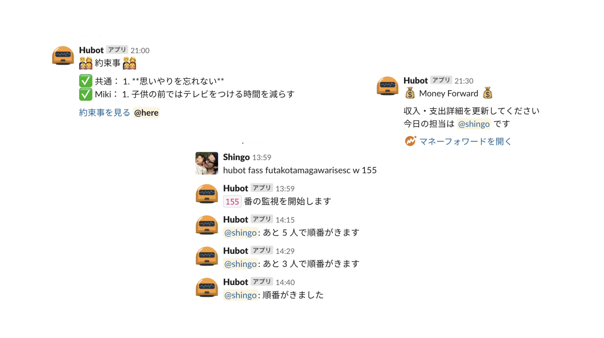
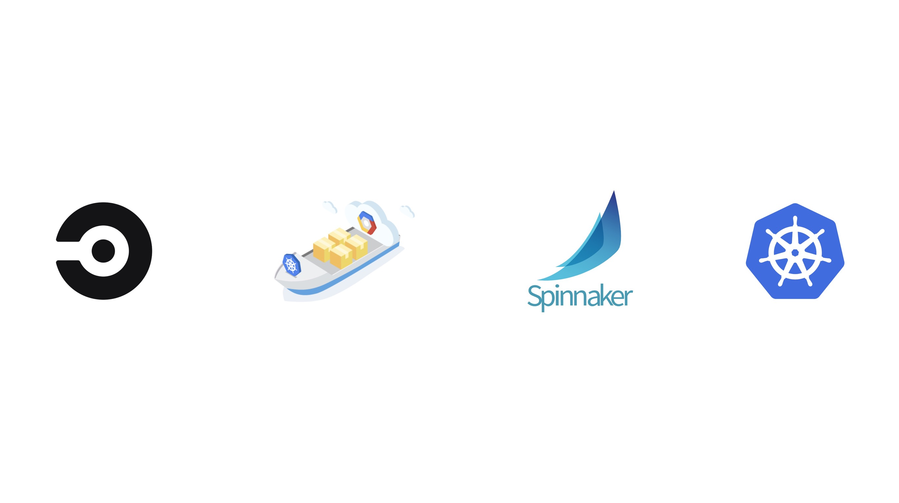

# Merpay での半年間

---

## Self Introduction

---


---



---


---


---


---


---

<!-- 

---

<p style="text-align: center; font-size: 2em;"><a href="https://ins0.jp/" target="_blank">ins0.jp</a></p>

--- -->

## Merpay Frontend Team

---


---

- CS Tool
- Merpay Partners Admin Tool
- Merchants Registration Form
- Campaign LP
- Coupon WebView

---

<p style="text-align: center; font-size: 2em;">
  Campaign LP /
  Coupon WebView
</p>

---


---


---

<p style="text-align: center; font-size: 2em;">Designers can operation by itself</p>

---

- Componentization
- Encapsulation
- Templating
- Simplicity

---



---

```ts
export function denyProduction({ env, error }: Context) {
  if (env.APP_ENV === 'production') {
    return error({ statusCode: 404 });
  }
}
```

---

```ts
export function staticAssetsAccessControl(this: any, moduleOptions: ModuleOptions) {
  this.nuxt.hook('render:setupMiddleware', (app: Server) => {
    app.use((req: http.IncomingMessage, res: http.ServerResponse, next: (err?: any) => void) => {
      const { pathname } = parseUrl(req.url);

      if (/* check the `pathname` */) {
        return options.denyCallback(res);
      }

      return next();
    });
  });
```

---

<p style="text-align: center; font-size: 4em;">🙏</p>
