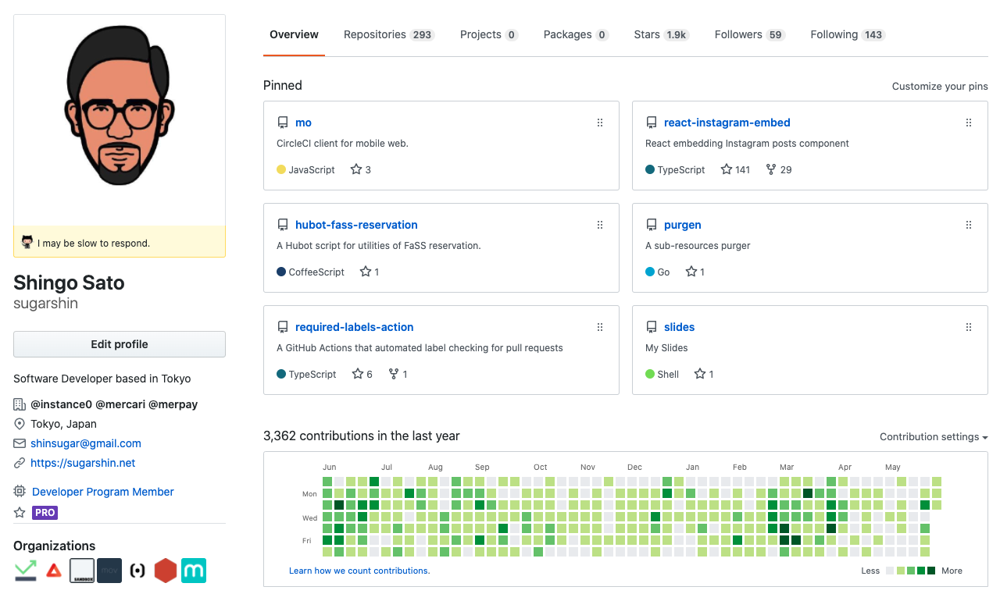
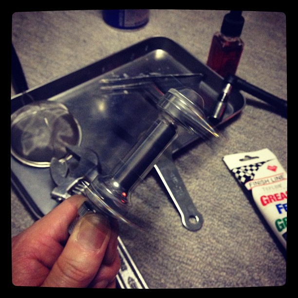
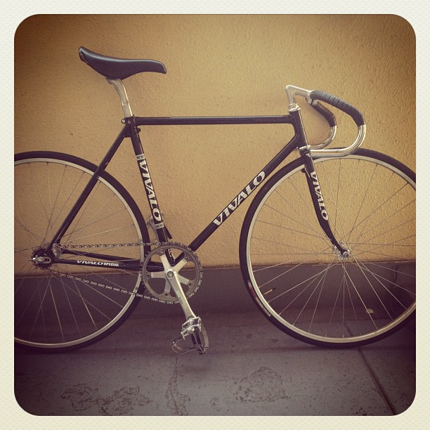
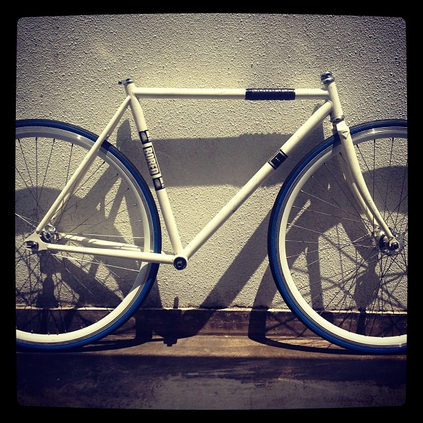
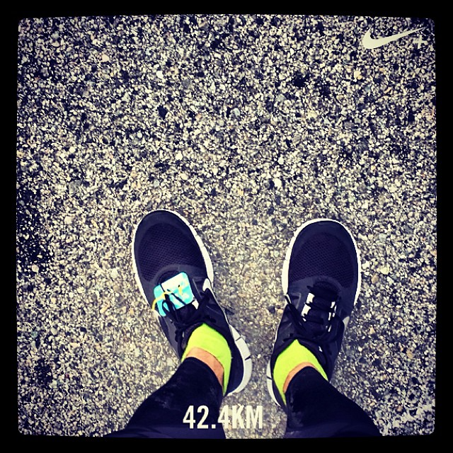
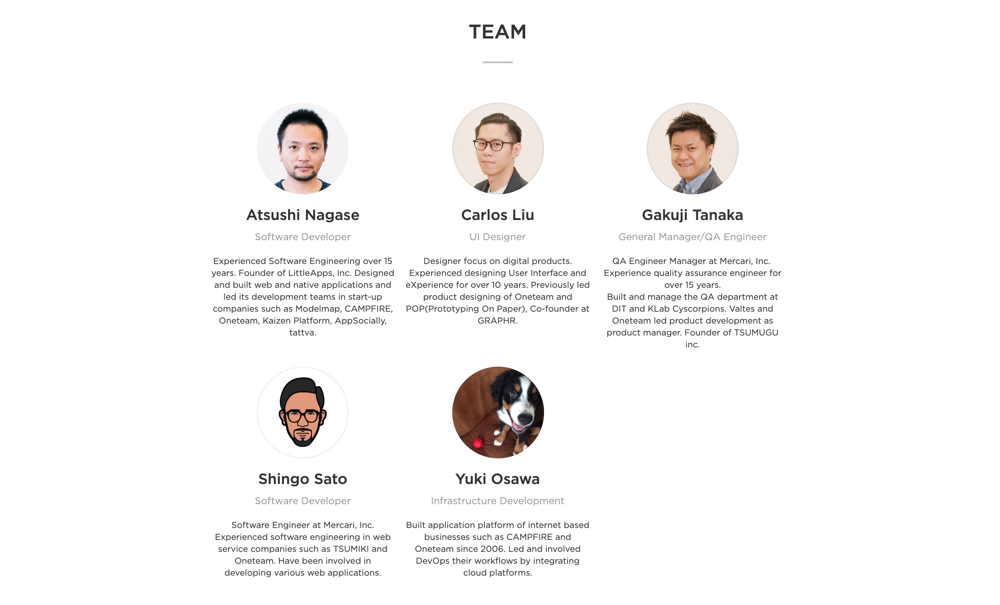
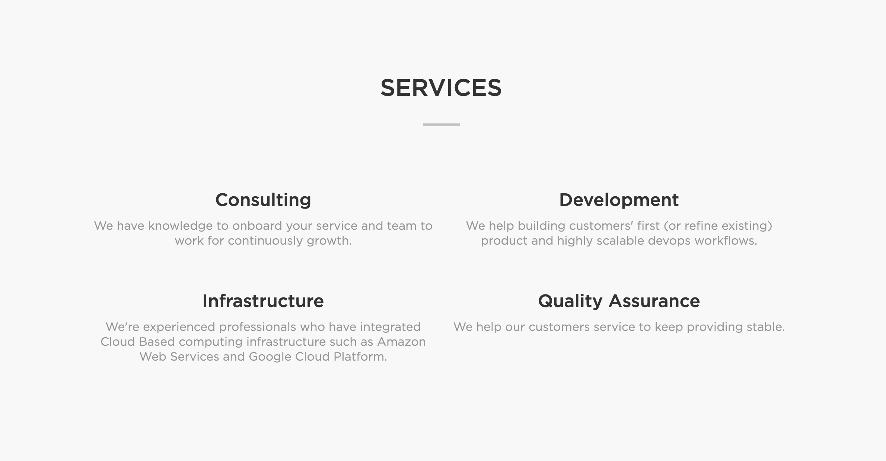

# Self Introduction 2020

Shingo Sato | @sugarshin

---

---

---

  
  
  

---

  

---

## Mercari, Inc.

---

- CS Tool
- Merpay
- Mercari Web

---

### CS Tool

---

### Merpay

---

  Campaign LP /
  Coupon WebView

---

  

---

  

---

  

---

### Mercari Web

---

### DevOps Team

- CI/CD
- Kubernetes
- Datadog
- Sentry

----

### Web Platform Team

- Session Management
- Gateway
- Slackbot

---

## Oneteam Inc.

---

  

---

  

---

  

---

  

---

  

---

  

---

🙏

